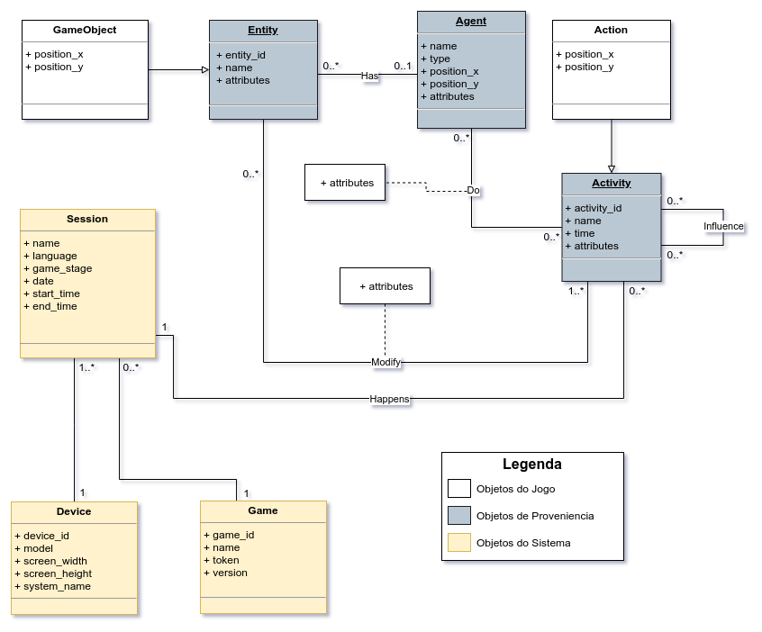
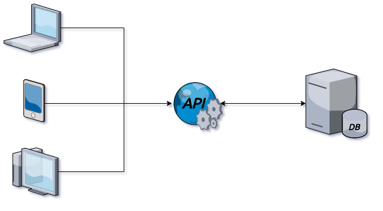

# Micélio - Plataforma de Proveniencia para Avaliação do Aprendizado em Jogos Educacionais 

O Micélio é uma API criada com o objetivo de armazenar dados de log de qualquer jogo, e a partir deles gerar grafos de proveniência para cada um deles. Por ter como objetivo abranger todos os tipos de jogos, tornou-se necessário criar um modelo de dados geral que pudesse armazenar as informações de qualquer um deles.

O modelo de dados foi criado baseando-se no modelo de proveniência PROV. O PROV utliza 3 termos para definir os vértices de um grafo de proveniência, são eles: <u>entidade</u>, <u>atividade</u> e <u>agente</u>.

- **Entidades**

  Uma entidade é definida como objetos físicos ou digitais. São elementos que não possuem uma lógica por trás deles. Podem ser itens como armas, poções ou até mesmo variáveis de ambiente como PH e saturação do solo.

- **Agentes**

  Um agente é definido como como um personagens dentro do jogo, sendo eles jogaveis (players), ou não (NPCs). São elementos que possuem responsabilidades, são usados para representar controladores de eventos. Podem ser qualquer personagem no jogo, ou uma entidade que gerencie eventos do jogo.

- **Atividades**

  Uma ativade é definida como as ações executadas por um agente ou uma interação entre um agente com outro agente, ou um agente com uma entidade. São os eventos que acontecem dentro do jogo. Podem ser uma ação de esquiva, uma troca de estação do ano ou o uso de uma poção.


## Modelo de Dados

O modelo de dados do Micélio foi pensado para que pudesse armazenar dados qualquer jogo. Além disso, as principais entidades foram basedas no modelo PROV, com o objetivo de conseguirmos montar grafos de proveniência para os dados armazenados. A Imagem 1 representa o diagrama de classes do modelo de dados utilizado pelo Micélio.




<center><b>Imagem 1:</b> Diagrama de Classes utilizado pelo Micélio para armazenamento dos dados.</center>


O Micélio foi projetado com o objetivo de ser uma via de mão única com os jogos, ou seja, a API recebe as informações mas não devolve nenhum dado. Isso foi pensado para que o jogo não dependa de uma resposta da API para seguir na sua história, tornando ele completamente independente da API. A Imagem 2 mostra como é feita a comunicação entre cada parte que interage com o sistema.




<center><b>Imagem 2:</b> Comunicação do Micélio entre os componentes</center>


Uma vez que um jogo é cadastrado ele recebe uma chave de acesso a API (token). Essa chave irá permitir que os jogos mandem requisições para o Micélio, e que ele possa identificar a qual jogo aquela requisição pertence.

Uma vez que um jogo é instalado em um dispositivo e é iniciado ele precisa enviar uma requisição de cadastro do dispositivo, nessa requisição é muito importante passar um identificador único do dispositivo, como o enderaço MAC. Essa informação nos permite identificar, para qualquer requisição de cadastramento de atividade, a qual sessão ela está relacionada. Como cada dispositivo só possui uma sessão simultânea, basta pegarmos a última sessão aberta por aquele dispositivo naquele jogo.


## Rotas API dos Logs

O Micélio foi dividido em 5 rotas principais, considerando o modelo de dados criado para API. Cada uma das rotas é acessada em uma determinada fase do jogo, desde seu cadastro até a inserção de informações geradas nas sessões. Cada fase de acesso da API pode ser definida pelos nomes abaixo:

- Cadastro do Jogo;
- Cadastro do Dispositivos;
- Inicio da Sessão;
- Inserção de Atividades;
- Término da Sessão.


### Cadastro do Jogo

Essa rota é acessada apenas uma vez para cada jogo criado. Ela serve para cadastrar um jogo no banco e gerar a chave de acesso do jogo para API.

**Rota:** `/game`

**Método:** POST

**Corpo:**

```json
{
	"name": "nome_do_jogo",
	"version": "versao_do_jogo"
}
```

Descrição:

- `name` : nome do jogo;

- `version` : versão do jogo.

  

**Objeto gerado para banco:**

```json
{
	"game_id": "id0019293",
    "token": "HVJHVADVSJA15D4S5DF1S5DF4S5AFDSD",
    "name": "nome_do_jogo",
	"version": "versao_do_jogo"
}
```

> Obs.: O `game_id` servirá para refenciar o jogo no banco de dados, enquanto o `token` servirá como chave para API, permitindo a mesma, identificar para qual jogo o log está sendo enviado.


------

### Cadastro do Dispositivos

Essa rota é acessada toda vez que um novo dispositivo quer enviar informações para API. Ela serve para identificar informações sobre o dispositivo que está utilizando o jogo.

**Rota:** `/device`

**Método:** POST

**Cabeçalho:**

```json
{
    "token":"HVJHVADVSJA15D4S5DF1S5DF4S5AFDSD",
}
```

**Corpo:**

```json
{
    	"device_id": "D-456",
    	"system_name": "android",
    	"model": "SG-90110",
    	"screen_width": "1080",
	    "screen_height": "720",
}
```

Descrição:

- `device_id` : identificação unica do dispositivo (MAC);

- `system` :  sistema operacional do dispositivo;

- `model` :  modelo do dispositivo;

- `screen_width` : tamanho da tela na horizontal;
  
- `screen_heigth` : tamanho da tela na vertical.

  

**Objeto gerado para banco:**

```json
{
    "device_id": "D-456",
    "system": "android",
    "model": "SG-90110",
    "screen_width": "1080",
    "screen_height": "720",
}
```


------

### Inicio da Sessão

Essa rota é acessada toda vez que um jogador inicia um jogo em um dispoisitivo ja cadastrado. Ela serve para identificar a sessão de um jogo.

**Rota:** `/session`

**Método:** POST

**Cabeçalho:**

```json
{
    "token":"HVJHVADVSJA15D4S5DF1S5DF4S5AFDSD",
    "device_id": "D-456",
}
```

**Corpo:**

```json
{
    "name": "name",
    "language": "language",
    "date": "10-10-2020",
    "game_stage": 1,
    "start_time": "11:00"
}
```

Descrição:

- `name` : nome da sessão, identificador específico criado pelo desenvolvedor do jogo (opcional);

- `language` : idioma em que a sessão está sendo executada;

- `date` : dia em que a sessão foi iniciada;

- `game_stage` : fase do jogo em que aquela sessão está sendo jogada, se o jogo possuir apenas uma fase basta passar sempre 1 como parâmetro;

- `start_time` : horário em que a sessão foi iniciada.

  

**Objeto gerado para banco:**

```json
{
    "game_id": "id0019293",
    "device_id": "D-456",
    "session_id": "654321324",
    "name": "name",
    "language": "language",
    "date": "10-10-2020",
    "game_stage": 1,
    "start_time": "11:00",
    "end_time": null 
}
```


------

### Inserção de Atividades

Essa rota é acessada após a criação de uma sessão, após criar uma sessão o jogo começa a enviar todas as atividades que acontecem nele. 

**Rota:** `/activity`

**Método:** POST

**Cabeçalho:**

```json
{
    "token":"HVJHVADVSJA15D4S5DF1S5DF4S5AFDSD",
    "device_id": "D-456",
}
```

**Corpo:**

```json
{
    "activity_id": "AC-45186727",
    "name": "plantar",
    "position_x": 6549,
    "position_y": 7564,
    "time": "4",
    "influenced_by": "AC-45186790",
    "attributes":[
        {
            "name": "time_moment", 
            "value": "night"
        }
    ],
    "entities": [
        {
            "entity_id": "P-01",
            "name": "Plant",
            "position_x": 12354,
            "position_x": 65498,
            "attributes": [
                {
                    "name": "health", 
                    "value": "50"
                }
            ],
        }
    ],
    "agents":[
        {
            "agent_id": "A-01",
            "name": "Sargeiro",
            "type": "NPC",
            "position_x": 12354,
            "position_x": 65498,
            "attributes":[
               {
                   "name": "energia",
                   "value": "100"
               }
            ]
       }
    ]
}
```

Descrição:

- `name` : ;
-  `position_x` : ;
-  `position_y` : ;
-  `time` : ;
-  `influenced_by` : ;
-  `attributes` : ;
  - `name` : ;
  - `value` : ;
-  `entities` : ;
    - `entity_id` : ;
    - `name` : ;
    - `position_x` : ;
    - `position_x` : ;
    - `attributes` : ;
        - `name` : ;
        - `value` : ;
-  `agents` : ;
    - `name` : ;
    - `type` : ;
    - `position_x` : ;
    - `position_x` : ;
    - `attributes` : ;
        - `name` : ;
        - `value` : ;

**Objetos gerado para banco:**

```json
{
    "session_id": "654321324",
    "activity_id": "AC-45186727",
    "name": "plantar",
    "position_x": 6549,
    "position_y": 7564,
    "time": "4",
    "attributes":[
        {
            "name": "vida", 
            "value": "50"
        }
    ],
    "entities": [
        {
            "entity_id": "P-01",
            "position_x": 12354,
            "position_x": 65498,
            "name": "Plant",
            "belong" :"A-57865",
            "attributes": [
                {
                    "name": "health", 
                    "value": "50"
                }
            ],
        }
    ],
    "agents":[
        {
            "agent_id": "A-57865",
            "name": "Sargeiro",
            "type": "NPC",
            "position_x": 12354,
            "position_x": 65498,
            "attributes":[
                {
                    "name": "energia",
                    "value": "100"
                }
            ]
        }
    ]
}
```


------

### Término da Sessão

Essa rota é acessada no final de cada sessão. Ela serve para encerrar determinada sessão. O encerramento da sessão é importante para definirmos se o usuário terminou ou não o jogo.

**Rota:** `/session`

**Método:** PUT

**Cabeçalho:**

```json
{
    "token":"HVJHVADVSJA15D4S5DF1S5DF4S5AFDSD",
    "device_id": "D-456",
}
```

**Corpo:**

```json
{
     "end_time": "11:00"
}
```

Descrição:

- `end_time` : horário em que a sessão foi encerrada.

  

> Obs.: Ao receber essa requisição o sistema identifica qual a última sessão aberta por aquele dispositivo naquele jogo e atualiza seu horário de término.