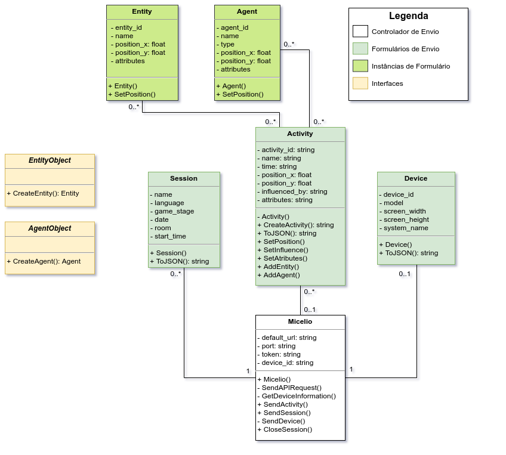

# MicelioUnity

O MicelioUnity é um módulo  construido em C# que pode ser utilizado para facilitar a integração de um jogo criado no Unity com a API do Micelio. Esse módulo possui todas classes necessárias para cadastro das informações, e além disso, ele torna alguns processos muito mais simples para o desenvolvedor, como por exemplo, gerar os identificadores únicos para certas instâncias e realizar as requisições para a API.


## Modelo De Classes

Embora torne o processo muito mais simples, a utilização do módulo não é obrigatória. Caso o jogo seja criado em uma outra plataforma de construção de jogos, por exemplo, torna-se necessário criar toda a lógica por trás do módulo. A **Imagem 1** mostra o modelo de classe utilizado para construir o módulo. 



<center><b>Imagem 1</b> - Diagrama de Classes utilizado no MicelioUnity</center>


## Utilização

Para utilizar o módulo é muito simples. Para utilizar, baixe ou clone o repositório, e copie a pasta [Provenance](https://github.com/GPMM/micelio/tree/main/MicelioUnity/Assets/Provenance), de dentro de `MicelioUnity->Assets->Provenance` para a pasta `Assets`, dentro do seu projeto Unity. Uma vez que a pasta está no seu projeto, você pode começar a utilizar o módulo para envio das informações.

A utilização do módulo se dá em duas etapas:

- Preparação das Classes;
- Envio dos Dados;


### Preparação das Classes

-------

O sistema do Micélio foi projetado para recolher dados de qualquer jogo. De forma geral, os componentes do jogo são divididos em 3 classes, entidades, agentes e atividades. A definição para cada um deles é explicada na [documentação](https://github.com/GPMM/micelio) geral da plataforma.

Para que o módulo possa classificar as classes do seu jogo como Agentes e Entidades é necessária uma preparação prévia das classes.


#### Definindo Entidades e Agentes

Para definir as suas classes como Agentes ou Entidades, o módulo MicelioUnity conta com duas interfaces que podem ser implementadas, e são elas:

- <u>EntityFactory:</u> Define uma classe como uma entidade no Micélio;
- <u>AgentFactory:</u> Define uma classe como um agente no Micélio.


Cada uma dessas interfaces possuem, respectivamente, os métodos `GetEntity` e `GetAgent`. Esses métodos servem para definir como uma classe pode se tornar uma entidade ou um agente. Eles serão utilizados para inserir os objetos nas atividades que serão enviadas para API.

Além da implementação das funções, é muito importante, definir um identificador único da entidade ou agente. Esse identificador servirá para reconhecer aquela instância, dessa forma, é possível identificar se aquela instância é nova ou está apenas sendo atualizada. 

Para criação desses identificadores as classes `Entity` e `Agent` oferecem os métodos staticos `GenerateEntityID()` e `GenerateAgentID()` que geram identificadores baseados no momento em que a instância foi criada. Embora esses métodos sejam oferecidos, a utilização deles não é obrigatória. Caso você deseje criar sua própria função geradora de IDs, tenha em mente que esses identificadores precisam ser diferentes para cada instância de cada objeto, dessa forma, o sistema pode identificar quando uma instância pertence ao mesmo agente/entidade.


### Implementação de Agentes e Entidades

##### EntityObject

Ao implementar a interface `EntityObject` é necessário criar o método `GetEntity()`, esse método deve retornar um objeto da classe `Entity`.

Para instanciar um `Entity` precisamos de apenas dois parâmetros, são eles:

- `id_entity` : Identificador único da entidade naquela sessão. Esse identificador deve ser atribuido por instância e não deve ser alterado durante a execução do jogo. Para geração dos IDs é recomendado que se crie um atributo na classe, que irá representar essa entidade, e inicialize ele utilizando a função estática disponível na classe `Entity` `GenerateEntityID()`, essa função irá retornar um ID baseado no momento de criação da instância. 

- `name` : Nome da entidade. Representa o significado daquela entidade, pode ser fixo, ou variar dependendo da instância.

  

  > Obs.1: O atributo ID **não** deve ser modificado, por conta disso, crie um atributo para manter o valor do ID, e gere ele apenas uma vez, não chame o método `GenerateEntityID()` dentro da chamada para o construtor `Entity(entity_id, name)`.

  > Obs. 2: Embora o atributo `role` não seja obrigatório para instânciar uma entidade, ele é necessário para o envio de uma entidade dentro de uma atividade. Caso não queira atribuir papeis estáticos para algumas classes, esse atributo pode ser passado junto à entidade quando for inserida em alguma atividade.

  

  ##### Parâmetros Opcionais

- `role` : Papel da entidade atualmente. É utilizado quando uma atividade é enviada para saber qual a participação da entidade no evento. Para definir o papel de uma entidade utilize o método `SetRole(string role)`.

- `position_x`, `position_y` e `position_z`: Posição atual da entidade. Define onde o objeto está apresentado na tela. Para definir a posição de uma entidade utilize o método `SetPosition(double x, double y, [double? z])`.

- `properties` : Propriedades gerais da entidade. Valores específicos de cada jogo. Para adicionar propriedades à entidade utilize o método `AddProperty(string name, object value)`.

  

O exemplo abaixo mostra como criar uma entidade `Arma` no Unity.

```c#
using System.Collections;
using System.Collections.Generic;
using UnityEngine;
using System;

public class Arma : EntityObject
{
    private string id_entity = Entity.GenerateEntityID();
    public string nome = "Arma";
    public double peso;
    public float poder ;

    public Soldado(float poder, double peso)
    {
        this.poder = poder;
        this.peso = peso;
    }

    void Start()
    {    

    }

    void Update()
    {
        
    }

    public Entity GetEntity()
    {   
        Entity e = new Entity(id_entity, nome);
		e.AddProperty("poder", poder);
        e.AddProperty("peso", peso);
        e.SetRole("arma utilizada");
        return e;

    }
}
```


##### AgentObject

Ao implementar a interface `AgentObject` é necessário criar o método `GetAgent()`, esse método deve retornar um objeto da classe `Agent`.

Para instanciar um `Agent` precisamos de apenas três parâmetros, são eles:

- `id_agent` : Identificador único do agente naquela sessão. Esse identificador deve ser atribuido por instância e não deve ser alterado durante a execução do jogo. Para geração dos IDs é recomendado que se crie um atributo na classe, que irá representar esse ID, e para gerá-lo, utilize a função estática disponível na classe `Agent` `GenerateEntityID()`, essa função irá retornar um ID baseado no momento de criação da instância.

- `name` : Nome do agente. Representa o significado daquele agente, pode ser fixo, ou variar dependendo da instância.

- `type` : Define o tipo de agente. Classifica os agentes identificando de que tipo eles são, não existe uma regra pra definir os tipos de agentes, mas opções que podem ser utilizadas são NPC, Player, GameManager, etc.

  

  > Obs.1: O atributo ID **não** deve ser modificado, por conta disso, crie um atributo para manter o valor do ID, e gere ele apenas uma vez, não chame o método `GenerateAgentID()` dentro da chamada para o construtor `Agent(agent_id, name)`.

  > Obs. 2: Embora o atributo `role` não seja obrigatório para instânciar um agente, ele é necessário para o envio de um agente dentro de uma atividade. Caso não queira atribuir papeis estáticos para algumas classes, esse atributo pode ser passado junto ao agente quando for inserido em alguma atividade.

  

  ##### Parâmetros Opcionais

- `role` : Papel do agente atualmente. É utilizado quando uma atividade é enviada para saber qual a participação do agente no evento. Para definir o papel de um agente utilize o método `SetRole(string role)`.

- `position_x`, `position_y` e `position_z` : Posição atual do agente. Define onde o objeto está apresentado na tela. Para definir a posição de um agente utilize o método `SetPosition(double x, double y, [double? z])`.

- `properties` : Propriedades gerais do agente. Valores específicos de cada jogo. Para adicionar propriedades ao agente utilize o método `AddProperty(string name, object value)`.


O exemplo abaixo mostra como criar um agente `Soldado`no Unity.

```c#
using System.Collections;
using System.Collections.Generic;
using UnityEngine;
using System;

public class Soldado : AgentObject
{
    private string id_agent = Agent.GenerateAgentID();
    public string nome = "Soldado";
    public string type = "player";
    public double posx;
    public double posy;
    public string patente;
    public int municao;
    public double hp;

    public Soldado(int municao, double hp, string patente, double x, double y)
    {
        this.municao = municao;
        this.hp = hp;
        this.patente = patente;
        this.posx = x;
        this.posy = y;
        
    }

    void Start()
    {    

    }

    void Update()
    {
        
    }

    public Agent GetAgent()
    {   
        Agent a = new Agent(id_agent, nome, type);
        a.SetPosition(posx,posy);
        a.AddProperty("munição", municao);
        a.AddProperty("pontos de vida", hp);
        a.AddProperty("patente", patente);
        return a;
    }
}

```

> Obs.: A posição no eixo z é opcional quando definido o atributo Position.

#### Considerações Finais

Definir o papel(role) de um agente, ou entidade, dentro dos métodos `GetAgent` e `GetEntity`, fará com que todas as instâncias daquela classe tenham o mesmo papel em todas as atividades. **Tenha cuidado ao fazer isso!** A role também poderá ser definida ao inserir o objeto dentro da atividade.


### Envio dos Dados

------

Para enviar dados para API é necessário possuir uma chave de acesso(token). Além disso é necessário enviar os payloads como são definidos na documentação. Com o objetivo de facilitar isso, a classe `Micelio` foi criada para abstrair todo esse processo.


#### Micelio

Toda lógica do módulo, relacionada a envio de dados, está centralizada na classe `Micelio`. O primeiro passo para utilizar, é garantir que sempre que o jogo for iniciado, uma instância do Micelio será criada a partir da chave de acesso do jogo, que é passada no construtor. Dentro da classe responsável por iniciar o seu jogo, crie o objeto Micelio:

```c#
using System.Collections;
using System.Collections.Generic;
using UnityEngine;

public class GameManager : MonoBehaviour
{
    public string token = "token-12345678";
    public static Micelio micelio;
    
    void Start()
    {
     
        micelio = new Micelio(token);

    }

    void Update()
    {

    }
}

```

> Obs.: O atributo `micelio` foi declarado com estático para que possa ser acessado pelas outras classes mais facilmente, sem precisar passar a instância a todo momento. Essa é uma boa prática para utilização, mas não é uma regra.


#### Fluxo de Envio

O fluxo para envio de dados para o Micelio segue a sequência abaixo:

1. **Cadastro do dispositivo:** sempre que uma instância do micelio é gerada, ela envia para API uma requisição de cadastro do dispositivo, e gera uma arquivo de configuração que diz ao sistema que aquele dispositivo ja foi cadastrado. Caso ja tenha sido cadastrado essa etapa é desconsiderada.
2. **Inicio de uma sessão:** uma vez que o dispositivo está cadastrado, ele recebe um identificador que permite que ele inicie sessões, essas sessões servem para identificar cada vez que um jogador joga o jogo, e nela, são armazenadas diversas atividades.
3. **Envio de atividades:** com uma sessão iniciada, o jogo pode enviar atividades que ocorrem dentro dele. Essas atividades são quaiquer eventos que acontecem dentro do jogo, e que você deseja que os dados sejam salvos.
4. **Finalização de uma sessão:** finalizar uma sessão é um bom costume. Quando o jogo termina, e não vamos mais enviar atividades para ela, podemos sinalizar que aquela sessão terminou. Isso é importante para sabermos que o jogo finalizou corretamente.


#### Envio de Sessões

Agora que temos um instância do Micelio criada, nos temos acesso a alguns métodos importantes, que permitirão cadastrar os logs de proveniência do nosso jogo. Dois dos principais métodos são:

- `micelio.StartSession(Session session);`

  Esse método será responsável por definir o início de uma sessão. Uma vez definida o início de uma sessão, seus dados não poderão mais ser alterados. 

  

- `micelio.CloseSession();`

  Esse método será responsável por definir o término de uma sessão. Embora não impacte na análise dos dados enviados, o término de uma sessão é muito importante. Através dele podemos saber so o jogo finalizou corretamente ou se ele foi fechado de forma inesperada, seja por um crash ou pela vontade do usuário.


Para que seja possível enviar uma sessão, precisamos criar uma instância de `Session`, que será passada como parâmetro da requisição. Embora uma sessão tenha diversos atributos, a criação de uma instância é muito simples, necessitando apenas do **idioma** e da **fase** em que o jogador se encontra. Uma vez criada a sessão, podemos chamar o método `StartSession()` e a partir dai, começar a enviar as atividades. Veja o exemplo:

```c#
using System.Collections;
using System.Collections.Generic;
using UnityEngine;

public class GameManager : MonoBehaviour
{
    public string token = "token-12345678";
    public static Micelio micelio;
    
    void Start()
    {
        micelio = new Micelio(token);
        
        Session s = new Session('pt-br','1');
        micelio.StartSession(s);
    }

    void Update()
    {
	
        // comandos
        
        // final da sessão
        micelio.CloseSession();
        
    }
}

```

> Obs. 1:  O parâmetros de idioma, obrigatório para a construção de uma sessão, não possui um formato específico para se seguir, porém, seguir um padrão na sua aplicação pode ajudar muito na análise dos dados. [Exemplo de padrão para idiomas](https://support.zendesk.com/hc/pt-br/articles/203761906-Suporte-a-Idiomas-por-produto-da-Zendesk).

> Obs. 2: Se o jogo não possuir mais de uma fase, coloque um valor que defina isso, como por exemplo: '0', '1', 'default'.


##### Parâmetros Opcionais

Opcionalmente, podemos definir informações como nome da sessão e grupo de sessão ao qual ela pertence, para isso, a classe `Session` disponibiliza 2 métodos, veja o exempo:

```c#
Session s = new Session('pt-br','bonus 2');
s.SetName('Holiday Event');
s.SetSessionGroup('0123-4567-8910');

micelio.StartSession(s);
```


##### 	Gerenciamento de Sessões

Uma sessão pode ser criada a cada vez que o jogador entra no jogo, mas isso não é uma regra. Se um jogo possui um menu inicial, pode ser que o usuário inicie várias sessões sem precisar reinicar o jogo. Neste caso a instanciação e envio das informações de sessão podem ser feitas na função `Update()` ao invés da função `Start()`.


#### Envio de Atividades

As atividades no Micelio representam eventos que aconteceram dentro do seu jogo. Esses eventos podem ser disparados por agentes, entidades ou até mesmo outros eventos. A forma como isso foi implementado no módulo é muito simples, basta que você crie uma instância de `Activity` e envie essa para a API através do método `micelio.SendActivity(Activity activity)`.

O método `micelio.SendActivity(Activity activity)`, retorna uma string contendo o identificador da atividade que foi enviada. Caso essa atividade gere uma outra atividade, pode ser importante guardar esse identificador.

Para criar uma atividade devem ser passados os atributos:

- `name` : Representa o nome de uma atividade, pode ser usado para identificar os eventos gerados no jogo.
- `time` : Representa o tempo do jogo em que aquele evento aconteceu. Não existe uma regra para definição do tempo, ele pode ser definido de acordo com a necessidade do seu jogo, podem ser: o tempo real, o tempo de execução do jogo ou até mesmo algo mais específico do seu jogo, como uma rodada, onda ou algo parecido.

Veja o exemplo abaixo do evento de atirar, `Fire()`, contruido dentro da classe `Soldado`, criada anteriormente:

```c#
using System.Collections;
using System.Collections.Generic;
using UnityEngine;
using System;

public class Soldado : MonoBehaviour, AgentObject
{
    private string id_agent = Agent.GenerateAgentID();
    public string nome = "Soldado";
    public string type = "player";
    public double posx;
    public double posy;
    public string patente;
    public int municao;
    public double hp;

    public Soldado(int municao, double hp, string patente, double x, double y)
    {
        this.municao = municao;
        this.hp = hp;
        this.patente = patente;
        this.posx = x;
        this.posy = y;
        
    }

    void Start()
    {    

    }

    void Update()
    {
        
    }

    public void Fire(Arma gun, string time)
    {   
        Debug.Log("pow");
        this.municao--;

        Activity fire = new Activity("fire", time);
        fire.SetPosition(this.posx,this.posy);
        fire.AddAgent(this, "atirador");
        fire.AddEntity(gun);
        micelio.SendActivity(fire);
    }

    public Agent GetAgent()
    {   
        Agent a = new Agent(id_agent, nome, type);
        a.SetPosition(posx,posy);
        a.AddProperty("munição", municao);
        a.AddProperty("pontos de vida", hp);
        a.AddProperty("patente", patente);
        return a;
    }
}
```

> Obs.: Repare que os métodos `AddAgent`  e `AddEntity` possuem um segundo parâmetro, opcional, que representa o papel (role) daquele objeto naquela atividade.
>
> Como o agente soldado não possui seu papel definido no método `GetAgent()`, o papel precisa ser indicado quado adicionado a uma atividade. Agentes e entidades, sem papeis definidos não são permitidos dentro de uma atividade.


##### Parâmetros Opcionais

- `influenced_by` : Define o identificador da atividade que gerou essa atividade. Esse parâmetro pode ser setado para ligar as atividades. Para definir o identificador utilize o método `SetInfluence(string activity_id)`.
- `position_x`, `position_y` e `position_z`: Posição atual da atividade. Define onde o evento aconteceu. Para definir a posição de uma atividade utilize o método `SetPosition(double x, double y, [double? z])`.
- `properties` : Propriedades gerais da atividade. Valores específicos para cada uma. Para adicionar propriedades à atividade utilize o método `AddProperty(string name, object value)`.
- `agents` : Array que define todos os agentes que participaram daquele evento. Para adicionar agentes a um evento utilize o método `AddAgent(AgentFactory agent_object)`, ou  `AddAgent(AgentFactory agent_object, string role)`.
- `entities` : Array que define todos entidades que participaram daquele evento. Para adicionar entidades a um evento utilize o método `AddEntity(EntintyFactory entity_object)`, ou  `AddEntity(EntintyFactory entity_object, string role)`.


### Ranking

------

Além do armazenamento dos Logs do seu jogo o Micelio oferece um serviço de Ranking. Para utilizá-lo é muito simples, basta que no seu jogo você crie uma atividade chamada "ranking", e nela inclua todas as informações necessárias para o ranking. De forma mais simples, você pode incluir as informações necessárias dentro das propriedades dessa atividade, veja:

```c#
public void EnviaRanking(string time, Player player)
{
    Activity ranking = new Activity("ranking", time);    
    ranking.AddProperty("Nome", player.name);
    ranking.AddProperty("Pontuação", player.score);
    micelio.SendActivity(fire);
}
```

O exemplo mostrado acima é um caso simples de ranking, mas caso seja um evento mais complexo, que inclua agentes, entidades, posição, não existe nenhum impedimento, basta tratar o evento como uma atividade comum e incluir o nome "ranking" nela.

A busca pelos dados ainda está sendo implementada, mas logo logo você terá acesso à essas informações.


