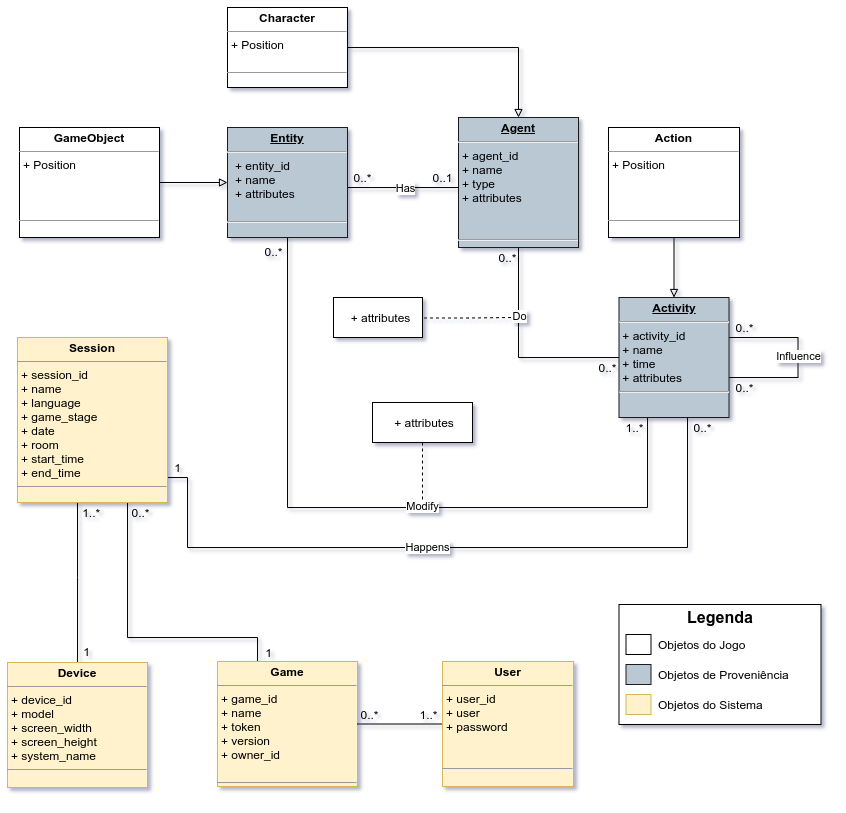
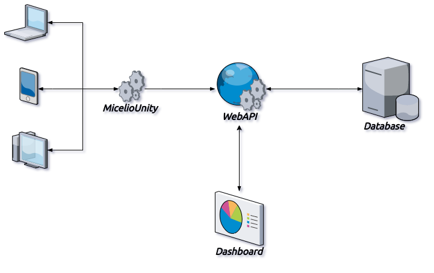

# Micélio - Plataforma de Proveniencia para Avaliação do Aprendizado em Jogos Educacionais 

O Micélio é uma plataforma de proveniência criada com o objetivo de recolher e armazenar dados de log de qualquer jogo, e a partir deles gerar visualizações dos dados de proveniência. O principal objetivo da plataforma é, através dos dados de proveniência, conseguir avaliar o aprendizado em jogos educacionais.

Por ter como objetivo abranger qualquer tipos de jogo, tornou-se necessário criar um modelo de dados geral que pudesse armazenar informações de forma genérica.

O modelo de dados foi criado baseando-se no modelo de proveniência PROV. O PROV analisa os dados de proveniência através de um grafo, esse grafo utliza 3 termos para definir seus vértices, são eles: <u>entidade</u>, <u>atividade</u> e <u>agente</u>.

- **Entidades**

  Uma entidade é definida como objetos físicos ou digitais. São elementos que não possuem uma lógica por trás deles. Podem ser itens como armas, poções ou até mesmo variáveis de ambiente como PH e saturação do solo.

- **Agentes**

  Um agente é definido como como um personagens dentro do jogo, sendo eles jogaveis (players), ou não (NPCs). São elementos que possuem responsabilidades, são usados para representar controladores de eventos. Podem ser qualquer personagem, ou uma entidade que gerencie eventos no jogo.

- **Atividades**

  Uma ativade é definida como as ações executadas por um agente ou uma interação, entre um agente com outro agente, ou um agente com uma entidade. São os eventos que acontecem dentro do jogo. Podem ser uma ação de esquiva, uma troca de estação do ano ou o uso de uma poção.

## Módulos

A plataforma do Micélio conta com alguns módulos, são eles:

- MicelioAPI:

  [Saiba mais](https://github.com/GPMM/micelio/tree/main/MicelioAPI).

- MicelioUnity:

  [Saiba mais](https://github.com/GPMM/micelio/tree/main/MicelioUnity).

- MicélioDashboard:

  [Saiba mais](https://github.com/GPMM/micelio/tree/main/MicelioDashboard).

  

## Modelo de Dados

O modelo de dados do Micélio foi pensado para que pudesse armazenar dados qualquer jogo. Além disso, as principais entidades foram basedas no modelo PROV, com o objetivo de conseguirmos montar grafos de proveniência e outras formas de visualização para os dados armazenados. A **Imagem 1** representa o diagrama de classes do modelo de dados utilizado pelo Micélio.

<b>Imagem 1</b> - Diagrama de Classes utilizado pelo Micélio para armazenamento dos dados.

O modelo de dados foi definido com 3 tipos de entidades, Objetos do Jogo, Objetos de Proveniênica e Objetos do sistema. Objetos do Jogo são objetos derivados de Objetos de proveniênicia, ou informações associativas. Essas informações não são de extrema importância para montar os grafos, são informações opcionais que ajudam a detalhar mais as informações de cada objeto. Os Objetos de Proveniência são os objetos que guardam as informações essenciais para montarmos os grafos de proveniência seguindo o modelo base (PROV). Já os Objetos do Sistema são objetos que nos ajudam a diferenciar as informações enviadas, com eles podemos saber de que jogo, em qual dispotiviso e em qual sessão a informação foi gerada, e além disso, se o usuário ainda está logado naquela sessão.

O Micélio foi projetado com o objetivo de ser uma via de mão única com os jogos, ou seja, a API Web recebe as informações mas não devolve nenhum dado. Isso foi pensado para que o jogo não dependa de uma resposta da API para seguir na sua história, tornando ele completamente independente da API Web. A **Imagem 2** mostra como é feita a comunicação entre cada parte que interage com o sistema.

<b>Imagem 2</b> - Comunicação do Micélio entre os componentes

Uma vez que um jogo é cadastrado ele recebe uma chave de acesso a API (token). Essa chave irá permitir que os jogos mandem requisições para o Micélio, e que ele possa identificar a qual jogo aquela requisição pertence. O token gerado é um JWT com informações referentes aos jogos.

Uma vez que um jogo é instalado em um dispositivo, e é iniciado, ele precisa enviar uma requisição de cadastro do dispositivo, nessa requisição é muito importante passar um identificador único do dispositivo, como o enderaço MAC ou qualquer identificador disponibilizado pelo sistema. Essa informação nos permite identificar, para qualquer requisição de cadastro de atividade, a qual sessão ela está relacionada. Como cada dispositivo só possui uma sessão simultânea em cada jogo, basta pegarmos a última sessão aberta por aquele dispositivo naquele jogo.

